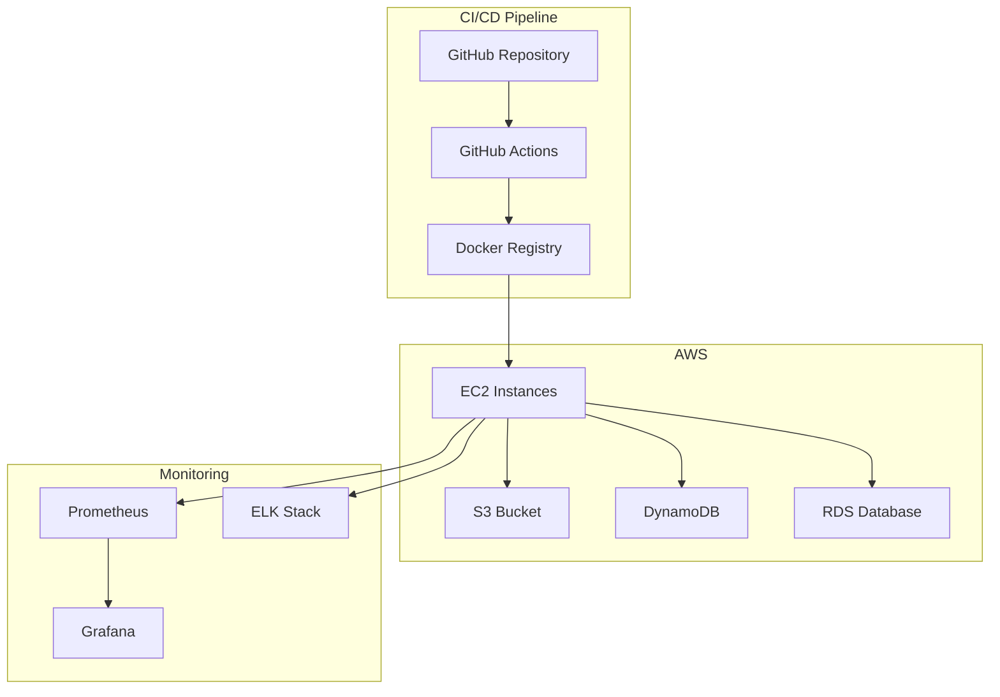
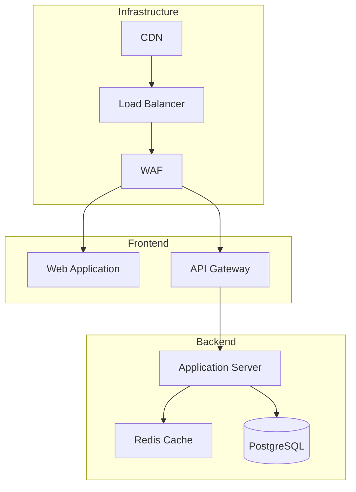
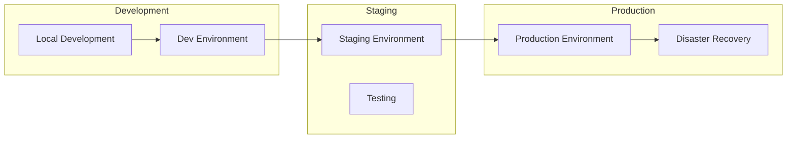
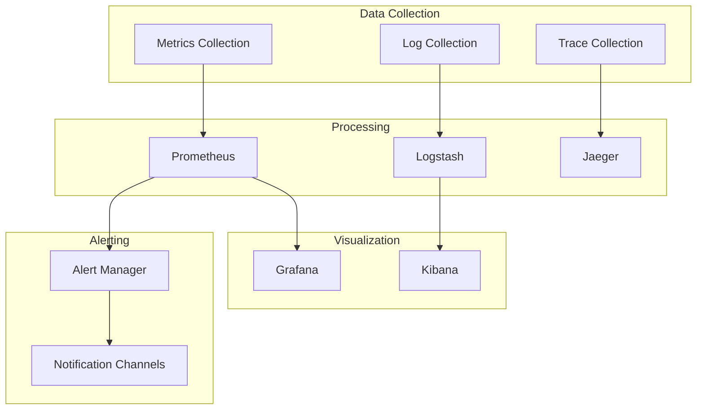

# System Architecture

## Overview

This document describes the architecture of our DevOps infrastructure and application deployment system.

## Infrastructure Architecture

## Application Architecture

## Deployment Architecture

## Monitoring Architecture

## Key Components

1. **Infrastructure**

   - AWS Cloud Infrastructure
   - Terraform for Infrastructure as Code
   - Docker for containerization
   - Kubernetes for orchestration (planned)

2. **CI/CD Pipeline**

   - GitHub Actions for automation
   - Docker for container builds
   - Automated testing and deployment

3. **Monitoring**

   - Prometheus for metrics
   - Grafana for visualization
   - ELK Stack for logging
   - Alert Manager for notifications

4. **Database**

   - PostgreSQL for primary data store
   - Redis for caching
   - Automated backups and recovery

5. **Security**
   - WAF for web application protection
   - SSL/TLS encryption
   - IAM for access control
   - Secrets management

## Data Flow

1. **Development Flow**

   - Code changes pushed to GitHub
   - Automated tests run in CI pipeline
   - Docker images built and stored
   - Deployment to development environment

2. **Production Flow**

   - Code promotion from staging
   - Automated deployment to production
   - Health checks and monitoring
   - Rollback capabilities if needed

3. **Monitoring Flow**
   - Metrics collected from all services
   - Logs aggregated and processed
   - Alerts triggered based on thresholds
   - Dashboards updated in real-time
